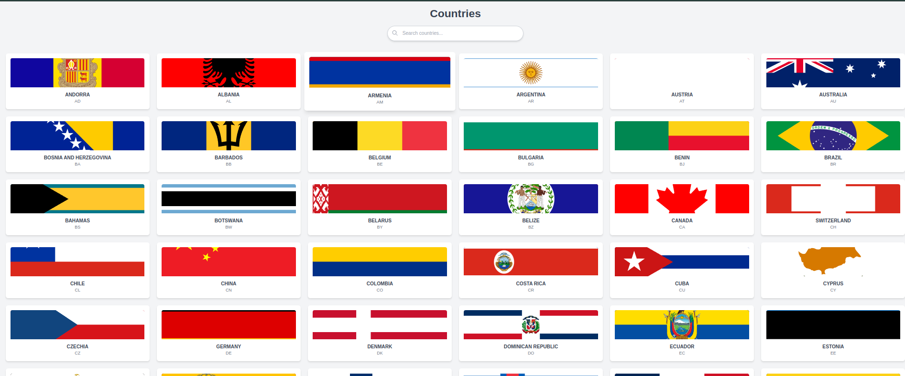
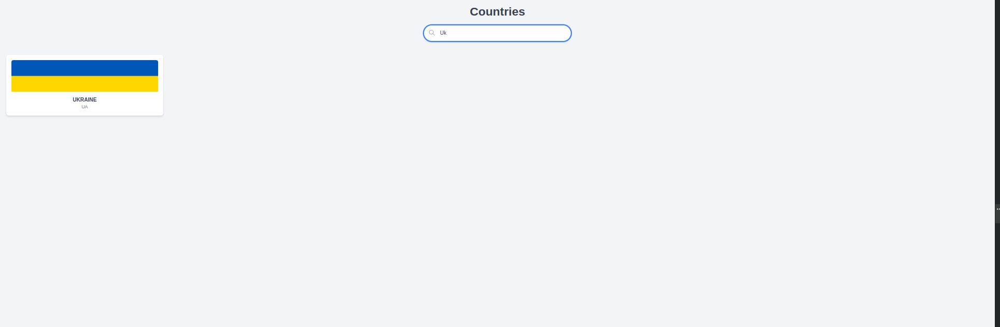
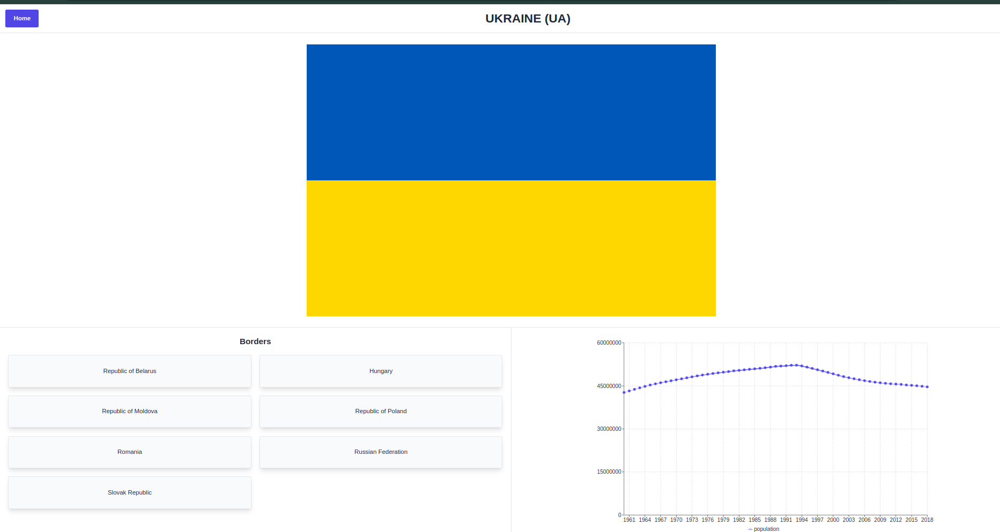

# Country Info App

Welcome to the **Country Info App**, a full-stack application designed to provide detailed information about countries, including border countries, population data, and flag images. This project is built with modern technologies and adheres to high-quality coding standards.


---

## Table of Contents
- [Project Overview](#project-overview)
- [Features](#features)
- [Tech Stack](#tech-stack)
- [Installation and Setup](#installation-and-setup)
- [Usage Instructions](#usage-instructions)
- [Folder Structure](#folder-structure)
- [API Documentation](#api-documentation)
- [Contributing](#contributing)
- [License](#license)

---

## Project Overview
The **Country Info App** consists of two main components:

### Main Pages:
#### Home:
  




### Backend:
- Built with **Nest.js**
- Provides API endpoints to:
  1. Retrieve a list of available countries.
  2. Fetch detailed information about a specific country, including:
     - Border countries.
     - Historical population data.
     - Flag image URL.

### Frontend:
- Built with **Next.js** 
- User interface for:
  1. Listing countries.
  2. Viewing detailed information about a selected country.

---

## Features
1. **Country List Page:**
   - Fetch and display a list of available countries.
   - Each country name navigates to its detailed info page.
2. **Country Info Page:**
   - Display country details, including name, flag, borders, and population chart.
   - Interactive navigation for border countries.
   - Population data visualization using charts.


---

## Tech Stack

### Backend:
- **Nest.js**

### Frontend:
- **Next.js**

### Additional Tools:
- **ESLint** and **Prettier** for code quality.
- **Tailwind CSS** for styling.
- **Recharts** for data visualization.

---

## Installation and Setup

### Prerequisites
- **Node.js** installed on your system.
- A package manager like **npm** or **yarn**.

### Steps
1. Clone the repository:
   ```bash
   git clone https://github.com/this-rafael/country-data-handler.git
   ```

2. Install dependencies for both backend and frontend:

   #### Backend:
   ```bash
   cd backend
   npm install
   ```

   #### Frontend:
   ```bash
   cd ../frontend
   npm install
   ```


3. Run the applications:

   #### Backend:
   ```bash
   cd backend
   npm run start:dev
   ```
   - The backend will run on `http://localhost:33333`.

   #### Frontend:
   ```bash
   cd ../frontend
   npm run dev
   ```
   - The frontend will run on the port specified in the console (by default: `http://localhost:3000`).

---

## Usage Instructions
1. Access the frontend in your browser at `http://localhost:3000` (or on the port shown after npm run dev on the frontend)
2. Navigate to the **Country List Page** to view available countries.
3. Click on a country name to view detailed information, including:
   - Border countries.
   - Population chart.
   - Flag image.


## Folder Structure

```
.
├── backend
│   ├── src
│   │   ├── app.controller.ts
│   │   ├── countries
│   │   │   ├── countries.controller.ts
│   │   │   ├── countries.module.ts
│   │   │   └── countries.service.ts
│   │   ├── borders
│   │   │   ├── borders.controller.ts
│   │   │   ├── borders.module.ts
│   │   │   └── borders.service.ts
│   │   └── population
│   │       ├── population.controller.ts
│   │       ├── population.module.ts
│   │       └── population.service.ts
│   └── test
├── frontend
│   ├── components
│   │   └── ChartComponent.jsx
│   ├── pages
│   │   ├── index.js
│   │   ├── country/[code].js
│   │   └── api/hello.js
│   └── styles
│       ├── globals.css
│       └── Home.module.css
```

